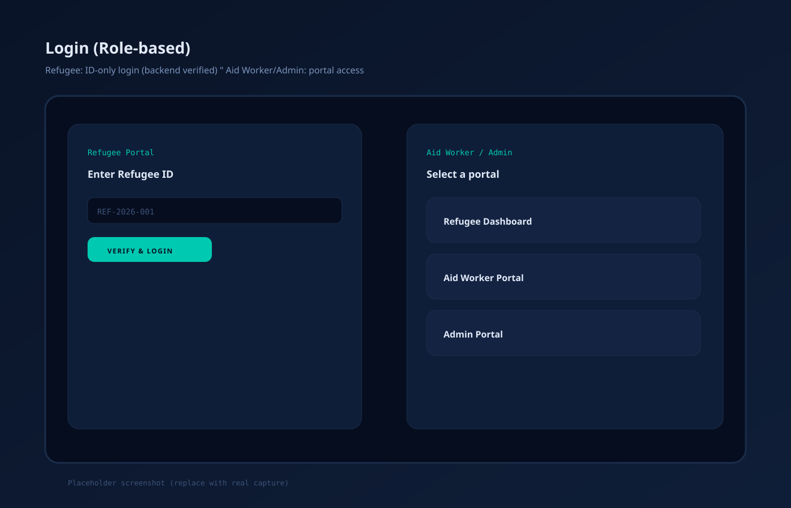

# Refugee Identity & Migration System (RIMS)

Modern, multi-portal identity system for humanitarian contexts, anchored on **Algorand** with a **backend-first security model**.


## What’s in this repo

- **Frontend (Vite + React)**: `projects/refugee-identity-system/Nexathon/src`
- **Backend (FastAPI)**: `projects/refugee-identity-system/Nexathon/backend/main.py`
- **Algorand app artifacts / contract**: `projects/refugee-identity-system/Nexathon/blockchain/`

## Feature tiles

<table>
  <tr>
    <td width="33%">
      <strong>Refugee Portal</strong><br/>
      ID-only login (backend verified) → Dashboard → Blockchain Status → Request Migration
    </td>
    <td width="33%">
      <strong>Aid Worker Portal</strong><br/>
      Register (incl. liveness) → Provision custodial wallet (W1) → View migration requests → Verify in tools
    </td>
    <td width="33%">
      <strong>Admin Portal</strong><br/>
      Stats + audit log + registered refugees + migration approvals
    </td>
  </tr>
  <tr>
    <td>
      <strong>Strict security posture</strong><br/>
      W1 private key never exposed to the frontend; blockchain interactions routed via backend APIs
    </td>
    <td>
      <strong>Wallet migration workflow</strong><br/>
      Refugee submits request (no wallet connect) → Aid Worker collects W2 signature → Admin approves on-chain
    </td>
    <td>
      <strong>Production-ready ergonomics</strong><br/>
      Robust error handling, consistent address display, and backend-driven pages (no mock data)
    </td>
  </tr>
</table>

## Screenshots

> Note: This repo currently ships **SVG placeholders** so the README renders immediately. Replace these with real captures using the same filenames under `docs/screenshots/`.

| Screen | Preview |
|---|---|
| Login (role-based) |  |
| Aid Worker • Register Refugee |  |
| Refugee • Dashboard |  |
| Aid Worker • Migration Requests |  |
| Aid Worker • Wallet Migration Tools |  |
| Admin • Overview |  |

## Quickstart (recommended)

### Prereqs

- **Node** (for Vite frontend)
- **Python + Poetry** (for FastAPI backend)
- Optional: **AlgoKit + Docker** (if you want LocalNet)

### Run backend + frontend (dev)

In one terminal:

```bash
cd projects/refugee-identity-system/Nexathon
npm run api
```

In another terminal:

```bash
cd projects/refugee-identity-system/Nexathon
npm run dev
```

Frontend: `http://localhost:5173`  
Backend: `http://127.0.0.1:8000`

## Core flows (end-to-end)

- **Register (Aid Worker)**: complete liveness → choose wallet type → for “No smartphone” provision **custodial W1** → print QR
- **Refugee login**: enter Refugee ID → backend verifies → refugee dashboard loads from backend
- **Request migration (Refugee)**: click “Submit migration request” (no wallet connect) → appears under Aid Worker “Migration Requests”
- **Verify/sign (Aid Worker)**: open “Wallet Migration Tools” → connect Pera (W2) → sign backend challenge → submit request
- **Approve (Admin)**: approve pending migration → backend attempts on-chain migrate (when available)

## Repo notes

- **Wallet address display**: UI shows `ABCD…WXYZ` style everywhere (Pera-like).
- **Storage files**: local JSON state (custodial wallets, migration requests, registry) is **local-only**; do not commit secrets.

