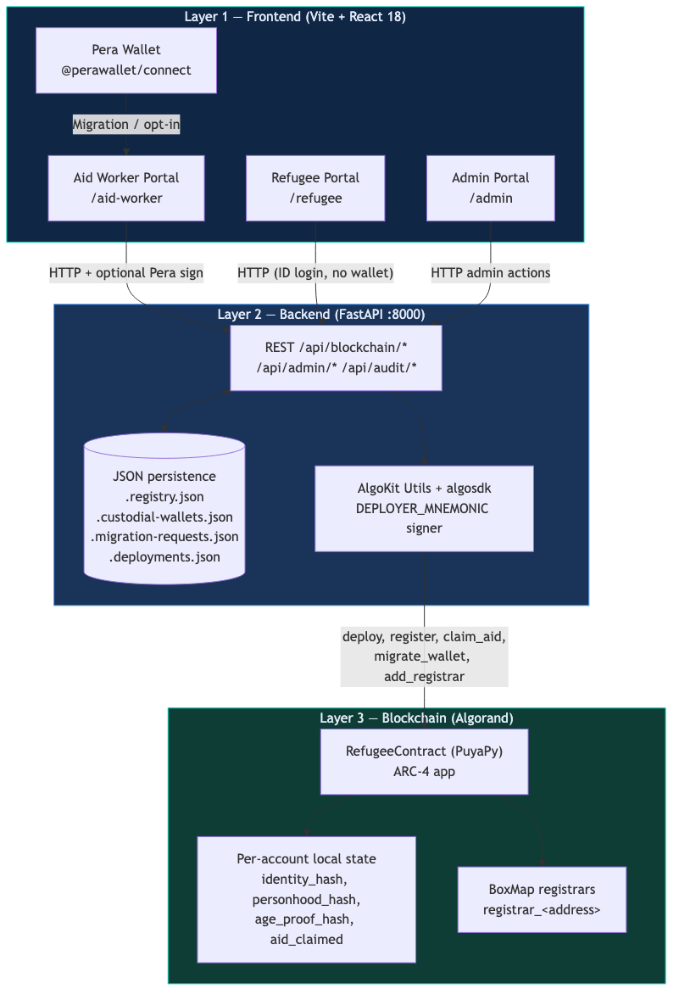
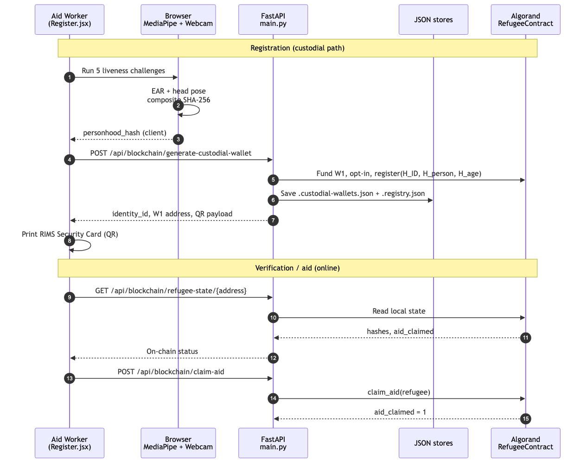
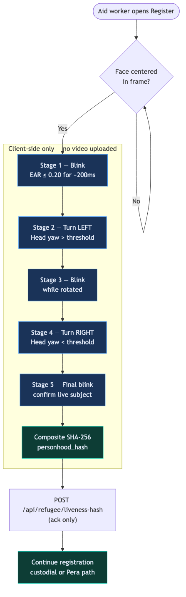
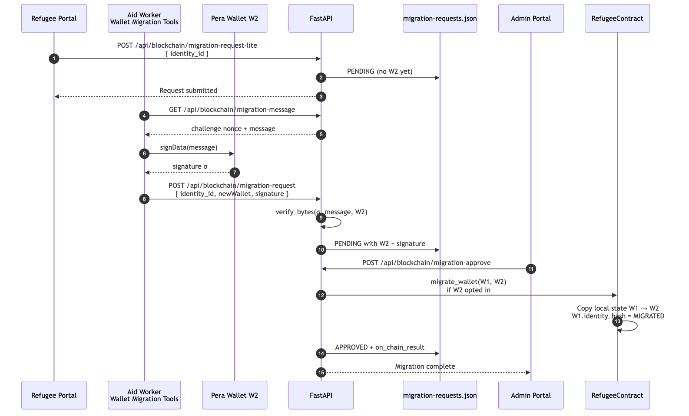

# RIMS Diagrams

Architecture and flow diagrams for the Refugee Identity & Migration System (RIMS). Each figure matches the documentation (README and project report).

| File | Figure | Description |
|------|--------|-------------|
| [01-three-layer-architecture.mmd](./01-three-layer-architecture.mmd) | Figure 1 | React → FastAPI → Algorand stack |
| [02-registration-data-flow.mmd](./02-registration-data-flow.mmd) | Figure 2 | Registration through verification |
| [03-liveness-pipeline.mmd](./03-liveness-pipeline.mmd) | Figure 3 | 5-stage MediaPipe liveness (Register.jsx) |
| [04-wallet-migration-protocol.mmd](./04-wallet-migration-protocol.mmd) | Figure 7 | Custodial W1 → sovereign W2 migration |
| [05-system-overview.mmd](./05-system-overview.mmd) | README | Portal + API + chain overview |
| [06-end-to-end-flows.mmd](./06-end-to-end-flows.mmd) | README | Core user journeys |
| [07-three-hash-commitment.mmd](./07-three-hash-commitment.mmd) | §3.2 | H_ID, H_person, H_age model |

## Rendered assets

| PNG | SVG |
|-----|-----|
|  | [svg](svg/01-three-layer-architecture.svg) |
|  | [svg](svg/02-registration-data-flow.svg) |
|  | [svg](svg/03-liveness-pipeline.svg) |
|  | [svg](svg/04-wallet-migration-protocol.svg) |

Regenerate PNG/SVG from source (uses **local** `@mermaid-js/mermaid-cli` via `npx` — no mermaid.ink API):

```bash
python3 scripts/render_diagrams.py
```

Requires **Node.js**. First run may download Chromium (~150MB). Edit `.mmd` files, then re-run.
